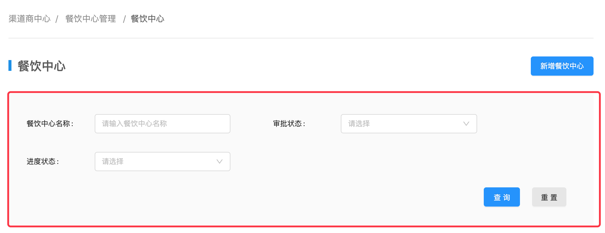

### context 内容包裹组件

#### 概述

context 内容包裹组件附带了面包屑，标题和标签状态的样式，使用它可以无需编写这些重复性的内容。

#### 组件示例

以下图为例，使用 context 组件后，你只需要关系红色线框中的内容展现，无需再写面包屑，标题等样式：



#### 代码示例

```html
<xy-context
  :breadcrumb="[
    { name: '渠道商中心'},
    { name: '协作费管理', path: '/enterprise/bill' }, 
    { name: '账单详情' }
  ]"
  title="账单详情 "
  tag="审核中"
  :tag-status="5"
>
  <div>context 内容</div>
  <div slot="right">标题右侧内容</div>
</xy-context>
```

#### API

| 属性 | 类型 | 说明 | 默认值 |
| ------| ------ | ------ | :------: |
| breadcrumb | Array | 面包屑数据 | [] |
| title | String | 如果不提供 title，则默认会读取面包屑最后一项作为标题 | '' |
| tag | String | 出现在标题右侧的tag | '' |
| tagStatus | Number | 表示tag状态，可选值有2，3，5 | 0 |
| slot | VNode | 组件内容 | 无 |
| slot="right" | VNode | 标题右侧内容 | 无 |
