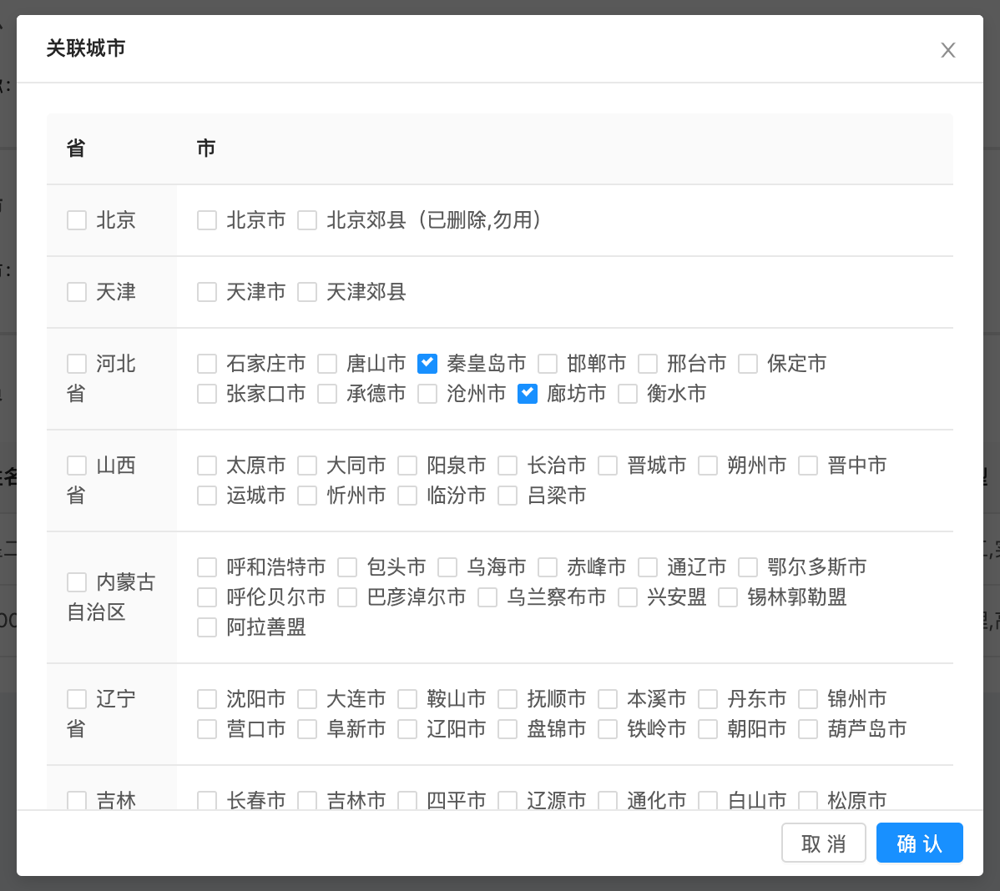

### select-city 城市多选弹窗

#### 概述

select-city 城市多选弹窗，选中省则选中省内的所有城市，选择部分城市则省显示为部分选中状态，同时也支持默认选中。

#### 组件示例


#### 代码示例

```html
<selct-city :initCity="cityList" @submitSelected="submitSelectedCity" :url="/api/v1/city/tree"/>
```

#### API

| 属性 | 类型 | 说明 | 默认值 |
| ------ | :------: | ------ | :------: |
| initCity | Array | 默认选中的城市，格式如['cityId1', 'cityId2'] | 空 |
| url | String | 获取城市列表接口地址，返回值格式如, [{children: [...],label: "北京",value: 110000},...] | 必填 |

| 方法 | 参数 | 说明 |
| ------ | :------: | ------: |
submitSelected | 选中城市 ID 数组 | 点击确定时执行 |
