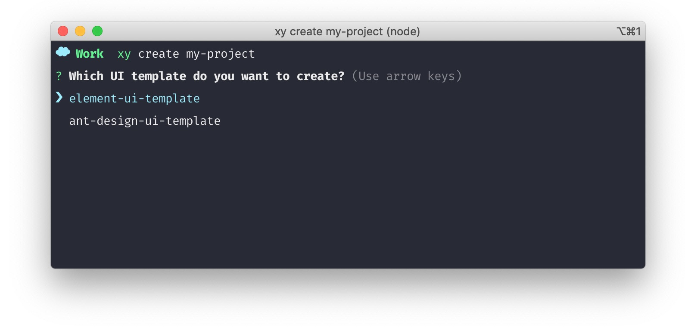

# 介绍
@xiyun/cli 工具可以用来快速创建一个项目，下载所需的代码片段，免去手动搭建环境的步骤，帮助您节省时间。

## 安装
```shell
$ yarn global add @xiyun/cli
```

## 配置
Windows 环境需要配置 Yarn 的 **环境变量**，MacOS 系统不需要配置。  

## 初始化
```shell
$ xy create 项目名称
```

**创建过程中，选择你需要用到的 UI 库：**  
- 从开放平台创建的应用需要选择 element-ui-template 模板
- 需要对接蚂蚁金服的项目，需要选择 ant-design-ui-template 模板


**接下来，选择布局方式：**
- 以”应用“的方式迁入在商家中心页面，需要选择 Simple layout 模板，作为一个可订购的应用存在
- 如果是独立的项目，有自己的头部和菜单，则需要选择 Full layout 模板


**Full layout 页面布局包含头部和左侧以及脚部等公用部分，页面如下图所示：**


**Simple layout 页面布局不包含头部和左侧以及脚部等公用部分，页面如下图所示：**


## 目录介绍
```
├── dist              # 打包后的文件目录
├── node_modules      # 第三方依赖包
├── public            # 公共文件，主要存储样式、字体、图片等
├── src               # 项目源码
│   ├── assets        # 公用样式、和静态资源，如 json 格式的文件
│   ├── components    # 组件目录
│   ├── config        # 配置文件目录，如导航菜单
│   ├── router        # 路由配置目录
│   ├── store         # vuex 的 store 目录
│   │   └── modules   # store 的 modules 目录
│   ├── utils         # 工具函数目录
│   └── views         # 项目页面目录
```

## 使用
```shell
# 启动项目
$ yarn start

# 打包项目
$ yarn build

# 代码格式检查
$ yarn run lint
```
