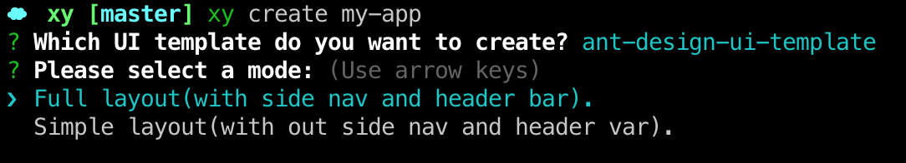

# 介绍

xy-cli 工具可以用来快速创建一个项目，下载所需的代码片段，免去手动搭建的步骤，节省时间。

## 安装

```shell
$ yarn global add @xiyun/cli
```

## 配置

#### windows环境需要配置yarn或者npm的环境变量，macOS系统不需要配置。

以yarn的环境变量配置为例，npm的配置方式与yarn类似。

配置yarn的环境变量： 找到yarn安装目录中的node_modules/.bin文件夹，将.bin的完整目录配置到环境变量中。

## 使用

```shell
$ xy create 项目名称
```
#### 创建过程中，需要在两个UI库中选择其一：


说明：
- element-ui-template：基于 ElementUI 框架开发的模板

- ant-design-ui-template: 基于 Ant Design Vue 框架开发的模板

#### 下一步中，需要选择布局方式：


说明：
- Full layout：页面布局包含头部和左侧以及脚部等公用部分，构建页面如下图所示：


说明：
- Simple layout：页面布局不包含头部和左侧以及脚部等公用部分，构建页面如下图所示：


之后一路向下，自动安装第三方依赖文件，初始化创建项目模板

## 项目目录结构

```
├── dist              # 打包文件目录
├── node_modules      # 第三方依赖包
├── public            # 公共文件，主要存储样式，字体，图片等
├── src               # 项目源码
│   ├── assets        # 公用样式
│   ├── components    # 公用组件目录
│   ├── plugins       # 按需引入组件配置目录
│   ├── router        # 路由配置目录
│   ├── store         # vuex 的 store 目录
│   │   └── modules   # store 的 modules 目录
│   ├── utils         # 工具函数目录
│   └── views         # 项目页面目录
```
## 使用

```shell
启动项目
$ yarn run start

打包项目
$ yarn run build

代码格式检查
$ yarn run lint
```

## 参与开发

1、克隆禧云生态代码
```shell
$ git clone https://github.com/xiyun-international/xy.git
$ cd xy
```
2、进行文件监听
```shell
$ yarn cli:watch
```
3、开发测试（以创建应用为例）
```shell
$ node ./package/cli/bin/xy.js create my-app
```
4、开发完成，执行编译
```shell
$ yarn cli:build
```
5、执行发布（如果你是以PR的方式贡献代码，那么这一步将由我们来执行）
```shell
$ lerna publish
```
