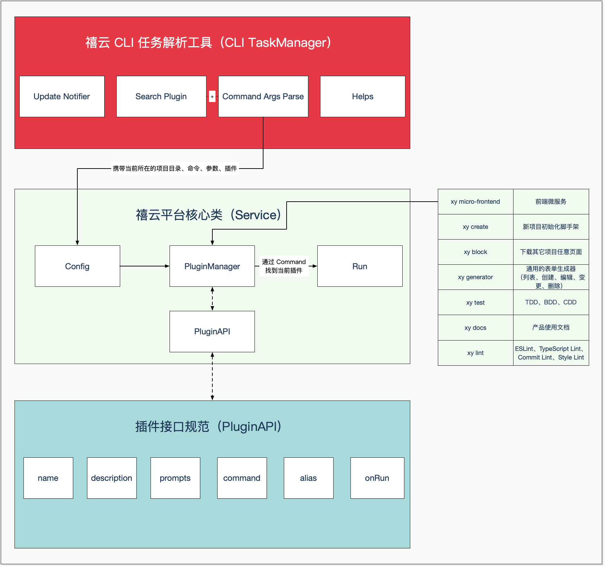

# 开发 @xiyun/cli 

1、克隆禧云生态代码

```bash
$ git clone https://github.com/xiyun-international/xy.git
$ cd xy
```

2、进行文件监听

```bash
$ yarn ts:dev
```

3、开发测试（以创建应用为例）

```bash
npx xy create my-app
```

4、开发完成，执行编译

```bash
$ yarn ts:build
```

5、执行发布（如果你是以PR的方式贡献代码，那么这一步将由我们来执行）

```bash
$ lerna publish
```

# CLI 架构图

