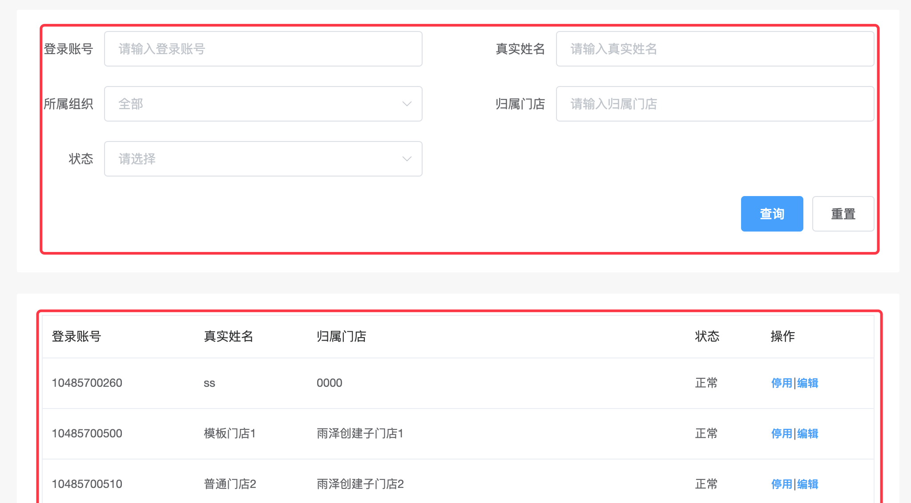

### wrapper 包裹容器

#### 概述

wrapper 是用来对一个业务区域进行包裹的组件，wrapper 带有 24px 28px 的 padding 和白色背景。

以一个业务场景来举例：
图中标红的两个地方都需要有一致的容器样式，使用 wrapper 组件统一作为包裹容器，那么项目中各业务块的样式就趋于统一了。



#### 代码示例

```html
<xy-wrapper>我是 wrapper 组件</xy-wrapper>
```
