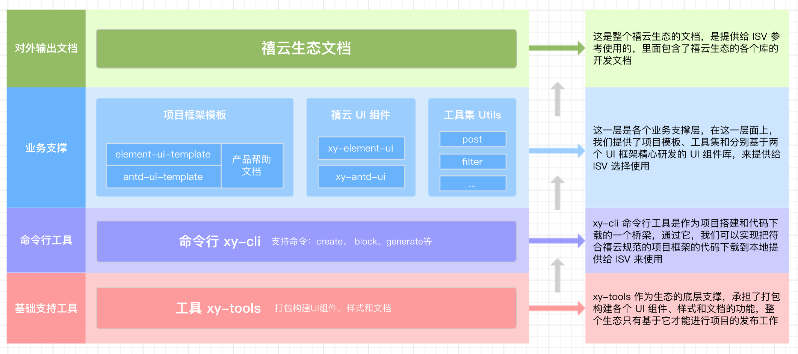

# 简介

禧云生态集合了命令行工具、UI组件和工具集，无需再进行额外的配置。只需一条命令即可完成项目的搭建、依赖安装和服务的启动，减少搭建和配置项目的时间。同时我们也提供了常用业务的 UI 组件，可以显著提高 ISV 开发的效率。

## 特性

* **命令行工具**，只需一条命令就可以搭建一套符合禧云生态规范的项目，不需要在额外的配置，即可满足于禧云的 UI、研发、交互 规范。
* **UI 组件**，我们为常用业务开发了公用组件，你可以直接使用；提供有发送短信验证码、时间轴、内容包裹等业务性组件。
* **工具集**，我们为业务开发了一系列工具集，你可以在需要的时候使用它们，会提升很多效率，如：HTTP 业务级的分装，敏感信息加密，PostMessage API 的封装等等。

## 架构
下图是禧云生态的架构图。

